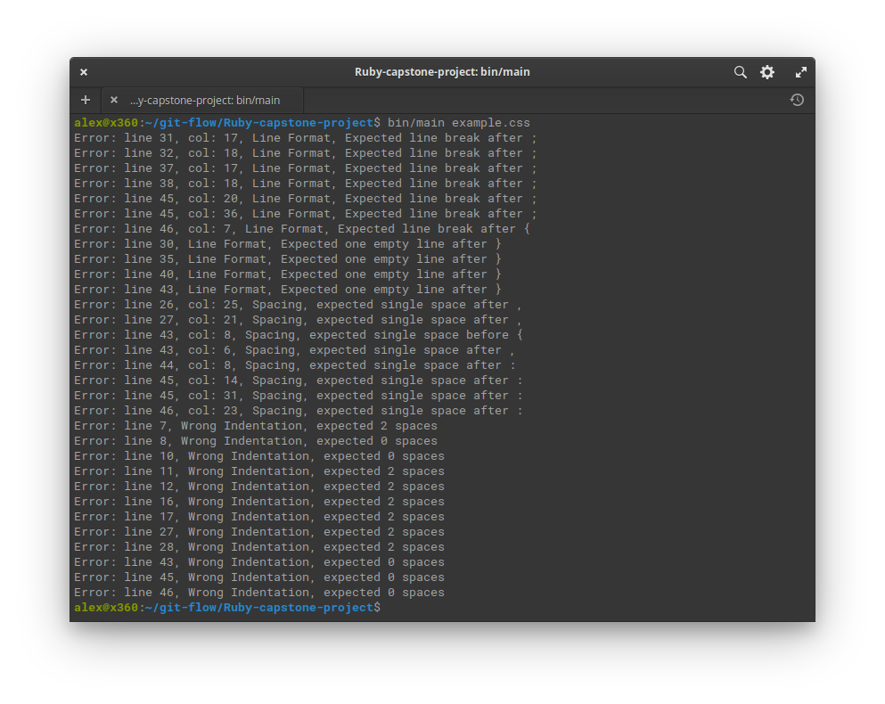

<!--
*** Thanks for checking out this README Template. If you have a suggestion that would
*** make this better, please fork the repo and create a pull request or simply open
*** an issue with the tag "enhancement".
*** Thanks again! Now go create something AMAZING! :D
-->

<!-- PROJECT SHIELDS -->
<!--
*** I'm using markdown "reference style" links for readability.
*** Reference links are enclosed in brackets [ ] instead of parentheses ( ).
*** See the bottom of this document for the declaration of the reference variables
*** for contributors-url, forks-url, etc. This is an optional, concise syntax you may use.
*** https://www.markdownguide.org/basic-syntax/#reference-style-links
-->
[![Contributors][contributors-shield]][contributors-url]
[![Forks][forks-shield]][forks-url]
[![Stargazers][stars-shield]][stars-url]
[![Issues][issues-shield]][issues-url]

<!-- PROJECT LOGO -->
<br />
<p align="center">
  <a href="https://github.com/rammazzoti2000/Ruby-capstone-project">
    
  </a>

  <h2 align="center">CSS Linter</h2>

  <h3 align="center">Ruby Capstone Project --> Build your own linter<h3>
  <p align="center">
    <a href="https://github.com/rammazzoti2000/Ruby-capstone-project"><strong>Explore the docs »</strong></a>
    <br />
    <br />
    -
    <a href="https://github.com/rammazzoti2000/Ruby-capstone-project/issues">Report Bug</a>
    -
    <a href="https://github.com/rammazzoti2000/Ruby-capstone-project/issues">Request Feature</a>
    -
  </p>
</p>

<!-- TABLE OF CONTENTS -->
## Table of Contents

* [About the Project](#about-the-project)
  * [Built With](#built-with)
* [Instructions](#instructions)
* [Video Presentation](#video-presentation)
* [Contributors](#contributors)
* [Acknowledgements](#acknowledgements)
* [License](#license)

<!-- ABOUT THE PROJECT -->
## About The Project

This is the **Ruby Capstone Project** required at the end of **Ruby** module in Microverse Curriculum.
Specifically is a **CSS Linter** with the purpose to check for spacing, indentation and format errors.

## Rules

**Indentation**
* 2 space indentation rule

bad code:
```css
  img {
  width: 700px;
  max-width: 100%;
}
```

good code:
```css
  img {
    width: 700px;
    max-width: 100%;
  }
```

**Line Format** 
* One line checking
* Line missing between css blocks

bad code:
```css
p {
  font-family: Helvetica, Arial, sans-serif;
  font-size: 14px;
}
a {
  color: #111111;
  font-size: 16px;
}
```

good code:
```css
p {
  font-family: Helvetica, Arial, sans-serif;
  font-size: 14px;
}

a {
  color: #111111;
  font-size: 16px;
}
```

**Spacing**
* Checking for missing spacing after **:** or **,**
* Checking for missing spacing after **{** or **}**
* Checking for line break after **{** or **}** and after each property declaration

bad code:

```css
a,p{color: #111111; font-size: 16px;}
div{color: #222222; font-size: 18px;}
```

good code:
```css
a {
  color: #111111;
  font-size: 16px;
}

div {
  color: #222222;
  font-size: 18px;
}
```


<!-- ABOUT THE PROJECT -->
## Instructions

The **_CSS Linter_** does basic syntax checking, as well as applying a set of rules to the code and throws back an error if bad syntax is found.
The throwback error is being printed out indicating the line and column of the specific syntax issue.

**Examples**
- Wrong Indentation, expected **_n_** spaces
- Spacing, expected single space before **'{'** and **'('**
- Spacing, expected single space after **')'** and **':'** and **','**
- Line Format, Expected line break after **'{'** and **'}'** and **';'**
- Line Format, Expected one empty line after **'}'**

To test out **CSS Linter** you need to:
* have **Ruby** installed on your computer
* [download](https://github.com/rammazzoti2000/Ruby-capstone-project/archive/feature/readme_instructions.zip) or clone this repo:
  - Clone with SSH:
  ```
  git@github.com:rammazzoti2000/Ruby-capstone-project.git
  ```
  - Clone with HTTPS:
  ```
  https://github.com/rammazzoti2000/Ruby-capstone-project.git
  ```
* Navigate to root directory of the repo and run:
```
$ bin/main path_to_file.css (path_to_file being the file you want to check for linters)
```


**Rspec testing**
* Change to **spec** directory
```
$ cd spec
```
* Finally run the command to execute rspec
```
$ rspec checks_spec.rb
```


### Built With
This project was built using these technologies.
* Ruby
* Rspec
* Rubocop
* VsCode

<!-- LIVE VERSION -->
## Video Presentation

Check out full presentation [here](https://www.loom.com/share/f17077929b4b484a8531d24ee1092598)

<!-- CONTACT -->
## Contributors

👤 **Alexandru Bangau**

- LinkedIn: [Alexandru Bangau](https://www.linkedin.com/in/alexandru-bangau/)
- GitHub: [@rammazzoti2000](https://github.com/rammazzoti2000)
- E-mail: bangau.alexandru@gmail.com


<!-- ACKNOWLEDGEMENTS -->
## Acknowledgements
* [Microverse](https://www.microverse.org/)
* [The Odin Project](https://www.theodinproject.com/)
* [Ruby Documentation](https://www.ruby-lang.org/en/documentation/)

<!-- MARKDOWN LINKS & IMAGES -->
<!-- https://www.markdownguide.org/basic-syntax/#reference-style-links -->
[contributors-shield]: https://img.shields.io/github/contributors/rammazzoti2000/Ruby-capstone-project.svg?style=flat-square
[contributors-url]: https://github.com/rammazzoti2000/Ruby-capstone-project/graphs/contributors
[forks-shield]: https://img.shields.io/github/forks/rammazzoti2000/Ruby-capstone-project.svg?style=flat-square
[forks-url]: https://github.com/rammazzoti2000/Ruby-capstone-project/network/members
[stars-shield]: https://img.shields.io/github/stars/rammazzoti2000/Ruby-capstone-project.svg?style=flat-square
[stars-url]: https://github.com/rammazzoti2000/Ruby-capstone-project/stargazers
[issues-shield]: https://img.shields.io/github/issues/rammazzoti2000/Ruby-capstone-project.svg?style=flat-square
[issues-url]: https://github.com/rammazzoti2000/Ruby-capstone-project/issues

## 📝 License

This project is [MIT](https://opensource.org/licenses/MIT) licensed.